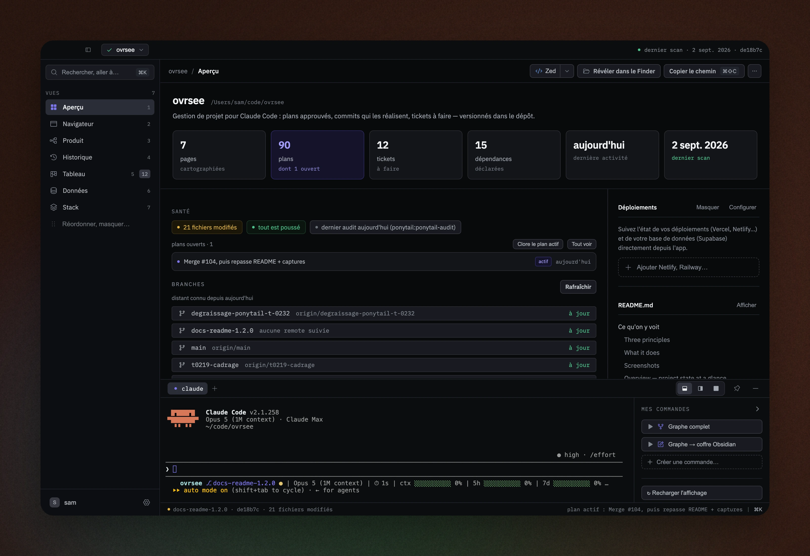
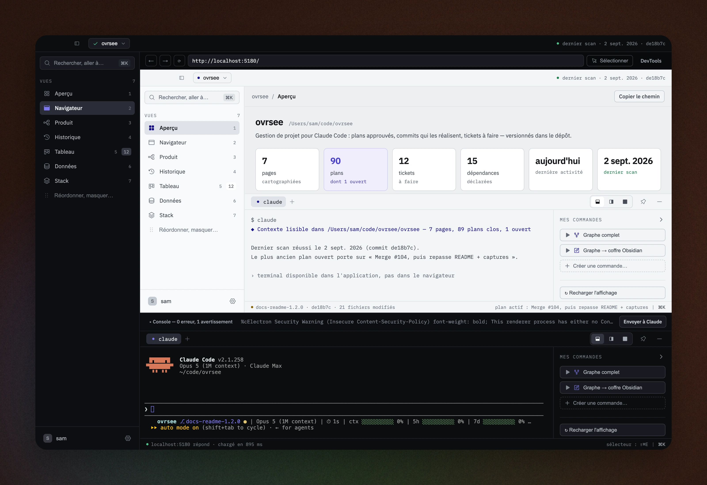
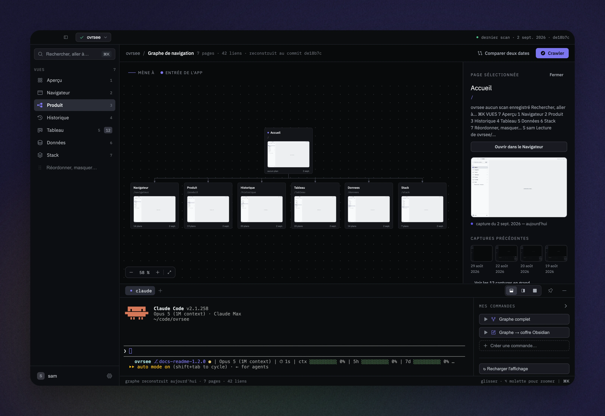
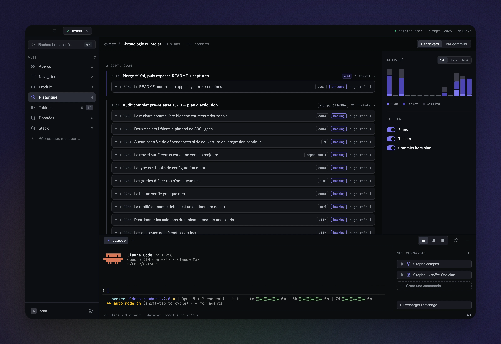
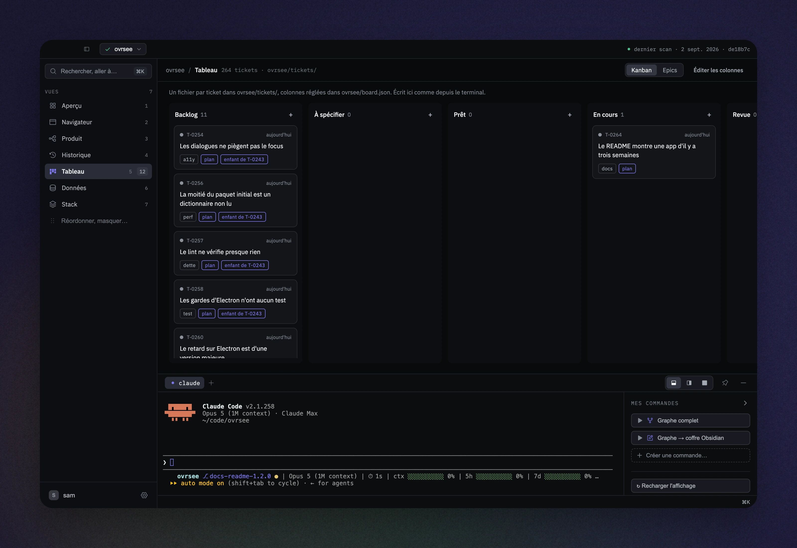
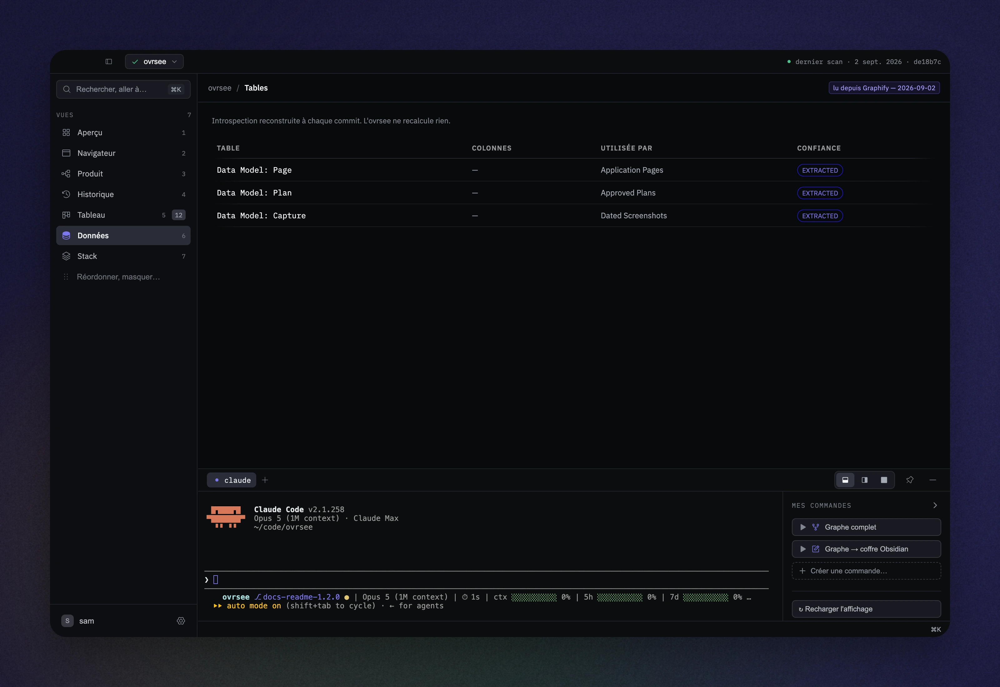
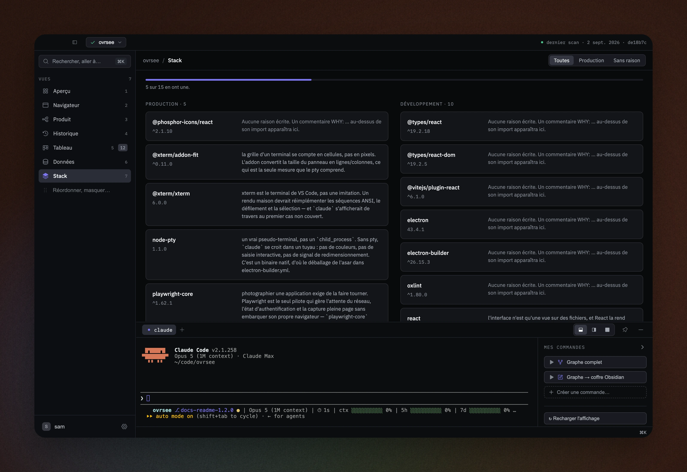

<p align="center">
  <a href="./README.md"></a>
  <a href="./README.fr.md"></a>
</p>

<div align="center">
  

  # Ovrsee

  **Vibecoder vite, sans perdre le fil du projet.**

  
  
  
</div>

Gestion de projet pour Claude Code. Ovrsee tient le suivi de ce que vous construisez :
les décisions que vous avez approuvées, les commits qui les réalisent, les tickets à
faire, l'architecture de l'app et son évolution. De quoi savoir où vous en êtes quand
on code au rythme de l'agent, et quoi faire ensuite.

> **L'ovrsee lit ; il n'exécute que le terminal qu'on lui demande.** La vérité vit dans `<repo>/ovrsee/`, en
> markdown et en images, versionnée par git. L'application n'est qu'une vue : si elle
> disparaît, rien n'est perdu.

Contexte complet : [`cadrage-ovrsee.md`](./cadrage-ovrsee.md)

## Trois principes

**Un plan, ses commits, ses tickets.** Chaque décision approuvée dans Claude Code devient
une ligne de projet : ce qui a été décidé, ce qui l'a exécuté, ce qui reste ouvert.

**Le projet vit dans le dépôt.** Backlog, historique et captures sous `<repo>/ovrsee/`,
versionnés par git. Pas d'outil à tenir à jour en parallèle du code.

**Claude Code y lit et y écrit.** Serveur MCP et deux skills : l'agent connaît votre
backlog, ouvre et déplace les tickets. Il n'exécute aucun code — vous restez maître du plan.

## Ce qu'on y voit

- Capture automatiquement les plans approuvés dans Claude Code — pourquoi une décision a
  été prise, pas seulement ce qui a changé.
- Photographie chaque écran à chaque commit : l'historique visuel de l'application, daté.
- Cartographie les pages du projet observé et leurs dépendances.
- Tient un tableau de tickets et une chronologie du travail, reliés aux plans qui les expliquent.
- Tout est stocké en markdown et en images versionnés — rien ne dépend de l'application
  elle-même pour rester lisible.
- Thème clair, sombre ou celui du poste — et une couleur d'accent par projet, pour ne
  jamais confondre deux fenêtres ouvertes côte à côte.

## En images

### Aperçu — l'état du projet en un coup d'œil


Compteurs (pages, plans, tickets, dépendances), santé du dépôt, plans ouverts, statut des
branches, et le terminal intégré avec, à côté, le panneau des commandes — crawl, graphe,
export Obsidian, plus celles qu'on y ajoute. À droite, le panneau des déploiements et le
sommaire du `README.md`. Le sélecteur de projet, en haut, montre quels dépôts ont une
session Claude en cours.

### Navigateur — parcourir l'application observée sans quitter l'ovrsee


Un navigateur intégré (barre d'adresse, DevTools, sélecteur d'élément) pour inspecter
l'application observée directement depuis l'interface. Un élément se commente sur
place : le commentaire et le descriptif partent à Claude, ou directement dans un ticket.

### Produit — le graphe de navigation


La carte des pages du projet crawlé, miniatures de captures à l'appui, avec un panneau de
détail par page et l'historique de ses captures précédentes. Deux dates se comparent.

### Historique — chaque commit et le plan qui l'explique


La chronologie du projet : un plan est clos par le commit qui l'exécute, chaque ticket lié
apparaît avec son statut. Filtrable par plans, tickets et commits hors plan.

### Tableau — le kanban des tickets


Un fichier par ticket dans `ovrsee/tickets/`, colonnes réglées dans `ovrsee/board.json`.
Écrit ici comme depuis le terminal intégré — une image collée dans un ticket est rangée
à côté de lui. Les epics affichent leur avancement et leurs tickets enfants dans leur
propre vue ; le kanban ne contient que des tickets.

### Données — les tables du projet


L'introspection reconstruite à chaque commit, lue depuis Graphify ou un coffre Obsidian :
tables, colonnes, qui s'en sert, et le niveau de confiance de l'extraction. L'ovrsee ne
recalcule rien.

### Stack — les dépendances et leur raison d'être


Production et développement séparés, chacune avec sa version et la raison écrite en
commentaire `WHY:` au-dessus de son import. Ce qui n'en a pas est signalé.

## Premier lancement

Un ovrsee fraîchement cloné, ou téléchargé, s'ouvre **vide** : aucun projet n'est
observé tant qu'on n'en a pas désigné un. Une modale de trois écrans explique alors ce
que fait l'application, règle l'interface d'après votre usage de Claude Code, et mène
au choix du premier dépôt. Elle se passe d'un clic — ou de la touche Échap — et se
rejoue depuis *Préférences → Général → Revoir la présentation*.

Les réponses ne sont pas décoratives : elles choisissent les onglets affichés, la
place du terminal et la commande proposée à l'ouverture d'un projet neuf. Tout
reste modifiable ensuite dans les préférences — y compris le thème (clair, sombre ou
celui du poste) et la couleur d'accent de chaque projet, qui est une préférence de
poste et ne s'écrit jamais dans le dépôt observé.

## Installation

### Installer l'application — la voie normale

Prendre la version de sa plateforme sur l'onglet
[Releases](https://github.com/samuelboulery/ovrsee/releases). Les binaires ne sont **ni
signés ni notariés** : macOS refuse le premier lancement — clic droit sur l'application,
puis *Ouvrir* — et Windows affiche un avertissement SmartScreen, qu'on passe par
*Informations complémentaires* puis *Exécuter quand même*.

| Plateforme | Format |
|---|---|
| macOS (arm64) | `.dmg`, non signé |
| Windows (x64) | Installeur NSIS, non signé |

**Il n'y a rien d'autre à installer.** Pas de clone, pas de `pnpm`, pas de ligne de
commande. Tout se fait dans l'interface :

1. Désigner un dépôt. L'écran d'équipement écrit `ovrsee/`, installe les hooks git et
   Claude Code, et propose les deux skills.
2. Remplir deux champs — la commande qui démarre l'application, et l'URL où elle répond.
   C'est ce qui écrit `ovrsee.config.json`.
3. Cliquer sur **Crawler** dans l'onglet Produit. L'application demande une fois
   d'approuver la commande `dev` — voir ci-dessous — puis parcourt les écrans et les
   photographie.

`ovrsee.config.json` est versionné : sa ligne `dev` est donc fournie par l'auteur du
dépôt observé, et le crawl la passe à un shell. Elle exige un accord explicite, gardé
dans `~/.claude/ovrsee/trust.json`, **hors du dépôt observé** — un clone hostile ne doit
pas livrer sa propre approbation. Ce qui est retenu est la chaîne exacte : changer `dev`
redemande l'accord. Sans humain (hook `post-commit`, stdin non TTY), le crawl refuse au
lieu de demander, et consigne le scan échoué.

Le crawl pilote le **Google Chrome déjà installé sur la machine** — rien ne se télécharge
au premier lancement. Sans Chrome, tous les autres onglets marchent ; seule la carte
reste vide.

### Depuis les sources — pour contribuer

```bash
pnpm install
pnpm electron          # application avec terminal intégré
pnpm dev               # ou dans un navigateur, sans terminal
```

C'est là que vivent les équivalents en ligne de commande, pour scripter ou pour équiper
un projet sans ouvrir l'application :

```bash
pnpm ovrsee:install /chemin/du/projet   # équiper un dépôt
pnpm ovrsee:crawl /chemin/du/projet     # le cartographier (exige ovrsee.config.json)
pnpm ovrsee:brief                       # lire l'état en texte
```

Empaqueter en local, sans publier :

```bash
pnpm package:mac    # DMG dans release/ (arm64)
pnpm package:win    # installeur NSIS dans release/ (x64, depuis Windows uniquement)
```

Les releases, elles, sont construites par `.github/workflows/release.yml` à chaque tag
`vX.Y.Z` poussé, sur des runners natifs, et publiées sur l'onglet Releases.

## Plans, commits, tickets

Quand un plan est approuvé dans Claude Code, il est capturé automatiquement dans `ovrsee/plans/`.
Le hook post-commit rattache ensuite chaque commit au plan actif. Clore le plan quand son travail est fini :

```bash
pnpm ovrsee:close                          # clôt tous les plans ouverts
pnpm ovrsee:close <plan.md>                # seulement celui-là
pnpm ovrsee:close <plan.md> --commit <sha> # un plan resté ouvert sans commit
```

Tant qu'un plan est actif, le hook post-commit lui rattache **tout** commit — même ceux
sans rapport. Clore n'est pas une formalité : c'est ce qui vous permet de changer de sujet
sans encombrer l'historique.

**Un squash-merge fait sur GitHub n'exécute aucun hook** : le commit naît sur leurs
serveurs, et rien ne le rattache. Le `git pull` rattrape — un hook `post-merge` lit les
tickets cités dans le message et rattache le commit à chacun des plans ouverts qui les
portent. Un dépôt équipé avant ce hook comble son retard d'un coup :

```bash
pnpm ovrsee:reconcile
```

Le terminal intégré n'existe que dans l'application : il passe par IPC, qu'un
navigateur n'a pas. C'est délibéré — l'exposer par une socket locale l'ouvrirait à
tout processus tournant sous le même compte. C'est un terminal complet : le pty ouvre
un shell de connexion et y lance `claude`. Le crawl emprunte la même voie, pour la même
raison, et jamais `/api/*`.

## Skills Claude Code

Deux skills disponibles — installer depuis l'écran d'initialisation, ou via `--skills` :

| Skill | Ce qu'il apprend |
|---|---|
| `ovrsee` | Lire `ovrsee/` : plans, pages, scans, captures, pièges de lecture |
| `ovrsee-tickets` | Écrire les tickets du tableau, format et gestes compris |

**Graphify** (alimente l'onglet Données) est détecté mais non installé — l'ovrsee
affiche sa commande.

## Coffre Obsidian

```bash
pnpm ovrsee:obsidian          # ou le bouton de l'onglet Accueil
```

Traduit `ovrsee/` en notes Obsidian dans `ovrsee/obsidian/` : frontmatter YAML
(requêtable en Dataview), wikilinks entre plans/tickets/pages, et les captures.
C'est une vue — la source reste le dépôt, réexporter écrase.

Graphify écrit son propre `index.md` à la racine du dossier qu'on lui donne. Réservez-lui `graphe/`,
que l'export ne touche jamais. Exemple :

```bash
/graphify . --obsidian --obsidian-dir ovrsee/obsidian/graphe
```

C'est ce que fait le bouton « ◈ Graphe → coffre Obsidian » du terminal intégré.

### Coffre comme source de l'onglet Données

Si vous documentez dans Obsidian plutôt qu'avec Graphify, le champ `obsidianVault`
dans `ovrsee.config.json` désigne un coffre, et l'onglet Données le lit **quand Graphify
n'a rien produit**.

Une note est une table quand son frontmatter porte `type: table`. `columns` en donne
les colonnes, `maj` la date de dernière mise à jour :

```markdown
---
type: table
titre: Commandes
columns: [id, client_id, total]
maj: 2026-03-12
---

Les commandes passées.
```

**Graphify passe devant, toujours** — son graphe vient du code, celui du coffre de ce
que quelqu'un a tapé. Un coffre déclaré alors que `graphify-out/graph.json` existe n'est
pas lu.

## Multi-projets et ovrsee.config.json

Exemple complet :

```json
{
  "dev": "pnpm dev --port 8099 --strictPort",
  "baseUrl": "http://localhost:8099",
  "entryRoutes": ["/", "/login"],
  "auth": { "storageState": ".ovrsee-auth.json" },
  "ignore": ["/auth/callback"],
  "obsidianVault": "~/Coffres/mon-projet"
}
```

Donnez au dev un port dédié. Le crawl refuse de démarrer si `baseUrl` répond déjà —
rien dans une réponse HTTP ne permet de reconnaître son propre serveur, et photographier
celui d'un autre projet produirait des captures datées d'aujourd'hui montrant la mauvaise application.

## Arborescence

| Dossier | Rôle |
|---|---|
| `hooks/` | Capture des plans, clôture au commit, rattrapage au pull, tickets, export Obsidian, CLI |
| `crawl/` | Parcours Playwright de l'app, captures datées |
| `server/` | Routes `/api/*` pour navigateur et Electron |
| `mcp/` | Serveur MCP stdio (JSON-RPC 2.0), même interface que `/api/*` |
| `app/src/` | Interface React, 7 onglets (aperçu, navigateur, produit, historique, tableau, données, stack) |
| `electron/` | Processus principal, preload, pty (terminal intégré) |
| `scripts/` | Utilitaires de build et test, captures du README |
| `site/` | La vitrine publique (ovrsee.app), écrite à la main, en anglais |

## Dépendances

Sobriété délibérée : **5 dépendances de production**, le reste est du Node et du React nus.

**Production**

| Paquet | Version | Pourquoi |
|---|---|---|
| `@phosphor-icons/react` | ^2.1.10 | les icônes de l'interface |
| `@xterm/xterm` | 6.0.0 | le terminal intégré |
| `@xterm/addon-fit` | ^0.11.0 | il suit la taille du panneau |
| `node-pty` | 1.1.0 | un vrai pty derrière ce terminal |
| `playwright-core` | ^1.62.1 | pilote le crawl, y compris dans l'app livrée |

**Développement**

| Paquet | Version |
|---|---|
| `react` | ^19.2.8 |
| `react-dom` | ^19.2.8 |
| `typescript` | ^7.0.2 |
| `vite` | ^8.2.2 |
| `electron` | 43.4.1 |
| `electron-builder` | ^26.15.3 |
| `oxlint` | ^1.80.0 |
| `@vitejs/plugin-react` | ^6.1.0 |
| `@types/react` | ^19.2.18 |
| `@types/react-dom` | ^19.2.5 |

Gestionnaire de paquets : `pnpm@11.22.0`, épinglé dans `package.json` et fait respecter
par Corepack. Depuis la version 11, `.npmrc` ne porte plus que l'authentification et le
registre :
tout autre réglage — la quarantaine `minimumReleaseAge`, la liste des paquets autorisés à
builder — vit dans `pnpm-workspace.yaml`, en camelCase.

## Pièges connus

**Un plan actif capte tous les commits de sa session.**
Le plan actif appartient à une session Claude, pas au dépôt : il vit dans
`ovrsee/.active/<session>.json`, que git ignore. Plusieurs sessions travaillent donc côte
à côte sur le même dépôt sans se voler leur plan. Au sein d'une session, en revanche,
chaque commit est rattaché — y compris un correctif sans rapport. `pnpm ovrsee:close`
avant de changer de sujet.

**Un commit dont la session est inconnue peut n'être rattaché à rien.**
L'attribution suit quatre étages : un ticket `T-XXXX` cité dans le message, puis la
session (`CLAUDE_CODE_SESSION_ID`, hérité par le hook git), puis l'unique plan actif s'il
n'y en a qu'un, puis rien. Un commit fait hors de Claude Code, sans ticket cité, alors que
deux plans sont actifs, n'est rattaché nulle part — et le dit sur stderr.

**La commande `dev` exige un accord, et il vit hors du dépôt.**
`ovrsee.config.json` est versionné : sa ligne `dev` vient de l'auteur du dépôt observé,
pas de vous, et le crawl la passe à un shell. Ce qui est retenu — dans
`~/.claude/ovrsee/trust.json` — est la chaîne exacte : un `dev` modifié redemande
l'accord. Ce n'est pas une revue de commande : `pnpm dev` est inoffensif à l'œil, ce
qu'il exécute vit dans le `package.json` de ce dépôt. On accorde une confiance à une
provenance.

**Le crawl refuse de démarrer si `baseUrl` répond déjà.**
C'est voulu. Rien dans une réponse HTTP ne distingue son propre serveur de celui d'un
autre projet.

**Le crawl exige Google Chrome installé.**
`playwright-core` voyage avec l'application, aucun navigateur ne l'accompagne : le crawler
pilote le Chrome du système (`channel: 'chrome'`). Rien ne se télécharge au premier
lancement, et rien ne prévient d'avance — une machine sans Chrome consigne simplement un
scan échoué.

**`node-pty` est un binaire natif.**
Il est déballé de l'asar (`asarUnpack` dans `electron-builder.yml`) et
`spawn-helper` doit garder son bit d'exécution — d'où `scripts/fix-pty-permissions.js`
en postinstall. C'est le point de rupture classique de l'empaquetage, et il ne se voit
qu'à l'exécution du DMG, jamais en dev.

**Un secret collé dans un plan approuvé part dans git en clair.**
La parade est en amont : ne pas en coller. Les identifiants vivent dans un gestionnaire
de mots de passe et dans un `ACCESS.md` non versionné.

## Serveur MCP

Ovrsee expose un serveur MCP (Model Context Protocol) en stdio. C'est le moyen pour
Claude Code de lire et modifier les tickets sans quitter son interface.

Onze outils : `listProjects`, `getProjectSummary`, `getBrief`, `getBoard`,
`listTickets`, `getPlans`, `getTimeline`, `getGraph` en lecture ; `createTicket`,
`updateTicket`, `moveTicket` en écriture.

Capacités :
- Lecture complète de `ovrsee/`
- Écriture sur `ovrsee/tickets/` et `ovrsee/board.json` uniquement
- Aucune exécution de code

Les réponses en lecture sont **projetées** : `getPlans`, `listTickets` et `getGraph`
rendent un résumé et omettent les corps, `full: true` donne l'entier. C'est une garde,
pas une commodité — le graphe complet pèse quelque 177 000 jetons.

Il ne lit que les projets du registre — celui qu'alimente `pnpm ovrsee:install`.
Un chemin qui n'y figure pas est refusé, même s'il existe sur le disque.

Pour l'enregistrer dans Claude Code :

```bash
claude mcp add -s user ovrsee -- node /chemin/absolu/ovrsee/mcp/server.js
```

Depuis l'**application installée**, sans dépôt cloné, le serveur voyage dans le paquet.
Ce n'est pas `node` qui le lance mais le binaire Ovrsee en mode node — c'est lui qui sait
lire `app.asar` :

```bash
claude mcp add -s user ovrsee -- \
  env ELECTRON_RUN_AS_NODE=1 \
  "/Applications/Ovrsee.app/Contents/MacOS/Ovrsee" \
  "/Applications/Ovrsee.app/Contents/Resources/app.asar/mcp/server.js"
```

La portée `user` est la bonne : le serveur est multi-projet par construction,
il n'a rien à voir avec le dépôt courant.

Dans Claude Desktop, c'est `claude_desktop_config.json` :

```json
{
  "mcpServers": {
    "ovrsee": {
      "command": "node",
      "args": ["/chemin/absolu/ovrsee/mcp/server.js"]
    }
  }
}
```

Les skills, elles, n'y sont pas visibles : `~/.claude/skills/` est lu par Claude
Code — en ligne de commande comme dans l'application de bureau — mais pas par le
chat de Claude Desktop, qui tient son propre catalogue.

Pour le voir répondre à la main :

```bash
printf '%s\n' \
 '{"jsonrpc":"2.0","id":1,"method":"initialize","params":{"protocolVersion":"2024-11-05"}}' \
 '{"jsonrpc":"2.0","id":2,"method":"tools/list"}' \
 | pnpm ovrsee:mcp
```

(Le serveur lit JSON-RPC depuis stdin et écrit sur stdout. Rien d'autre ne doit
sortir sur stdout : ce n'est pas un journal, c'est le transport.)

## Données produites

Stockées dans le dépôt observé, sous `<repo>/ovrsee/` :

```
plans/<date>-<slug>.md    1 fichier = 1 plan approuvé
pages/pages.json          pages, liens, résumés
pages/scans.jsonl         1 ligne par scan — les échecs aussi
pages/shots/<onglet>/     captures datées, rattachées à un commit
tickets/*.md              tickets du tableau
board.json                état du tableau
```

Backlog, historique et densité d'activité se calculent à partir des plans.

## Note importante

**Un secret collé dans un plan approuvé se retrouve dans l'historique git,** et l'y
retirer demande une réécriture. Ne pas l'ignorer via `.gitignore` — un plan non
versionné ne sert à rien. La parade est en amont — ne pas coller de clé, de jeton
ni de mot de passe dans un plan. Les identifiants vivent dans un gestionnaire et dans
un `ACCESS.md` non versionné.

## Tests

```bash
pnpm test       # node --test sur hooks/ crawl/ server/ mcp/ electron/ scripts/, puis app/src compilé
pnpm typecheck  # tsc, ne couvre que app/src
pnpm lint       # oxlint sur tous les dossiers de source
```

Aucun framework de test : `node:test` et `node:assert` seuls, dans tout le dépôt.
La CI lance lint, typecheck et le build de l'interface sur Ubuntu, puis la suite sur
**macOS et Windows** : cinq tests de portabilité cassaient sous Windows depuis des
semaines avant qu'elle existe.

## Voir aussi

- [`README.md`](./README.md) — version anglaise
- [`CHANGELOG.fr.md`](./CHANGELOG.fr.md) — ce qui a changé, version par version
- [`cadrage-ovrsee.md`](./cadrage-ovrsee.md) — problème, alternatives écartées, périmètre
- [`CLAUDE.md`](./CLAUDE.md) — référence technique du projet
