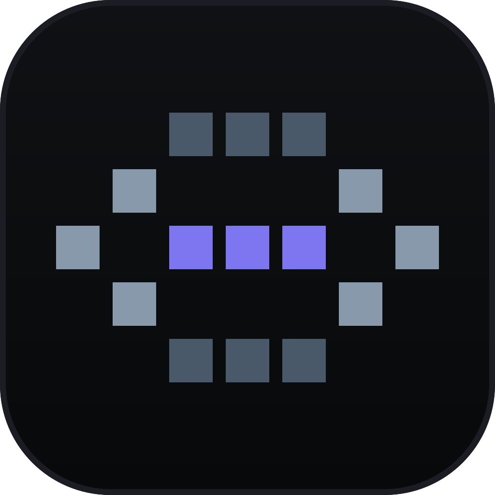
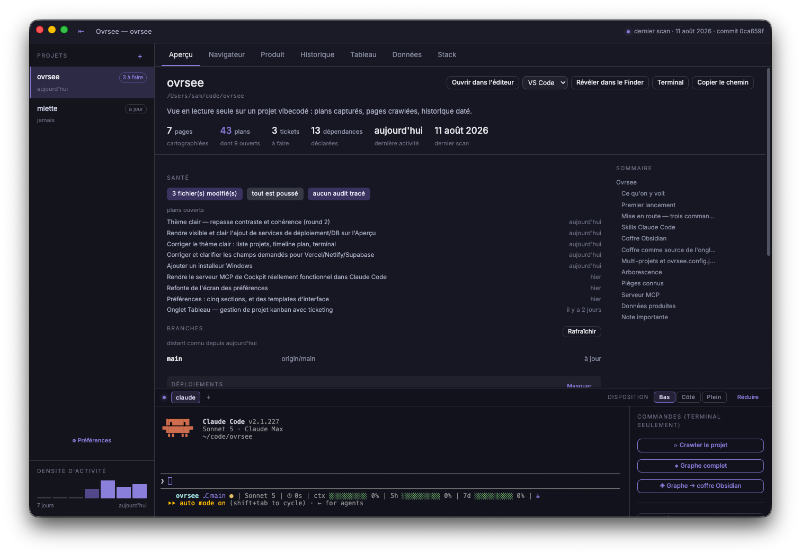
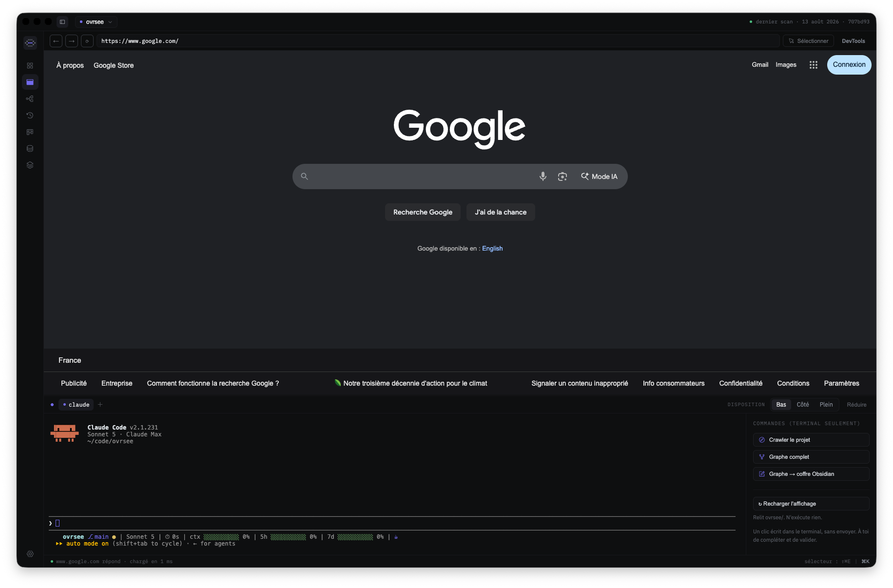
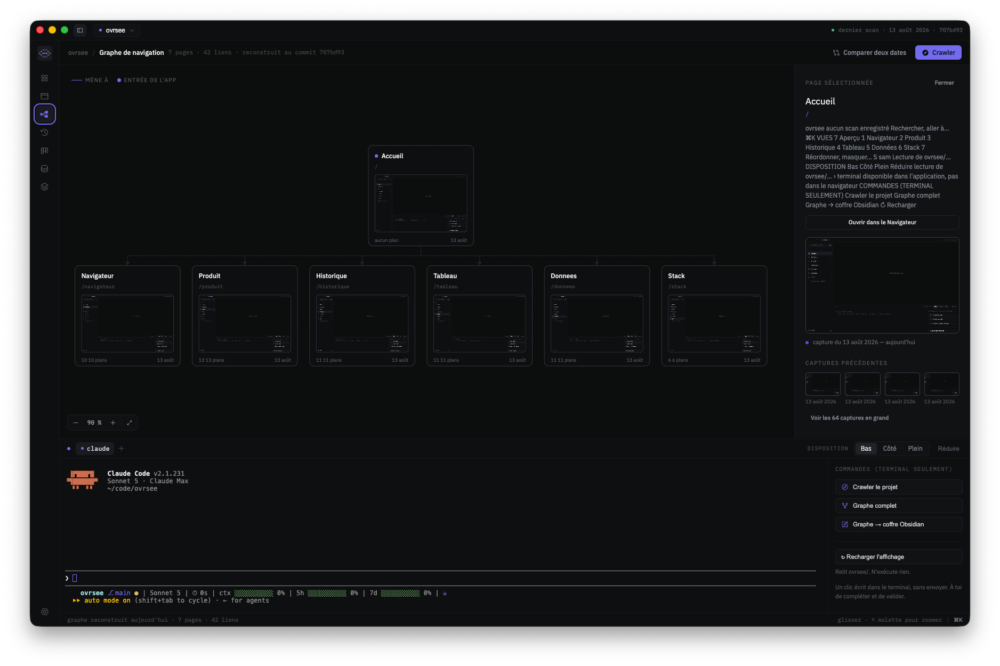
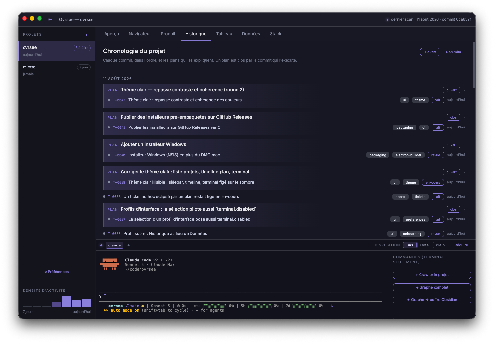
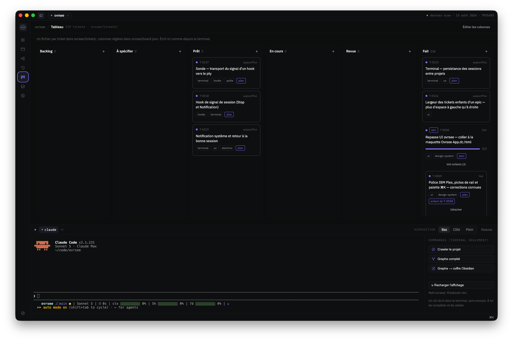
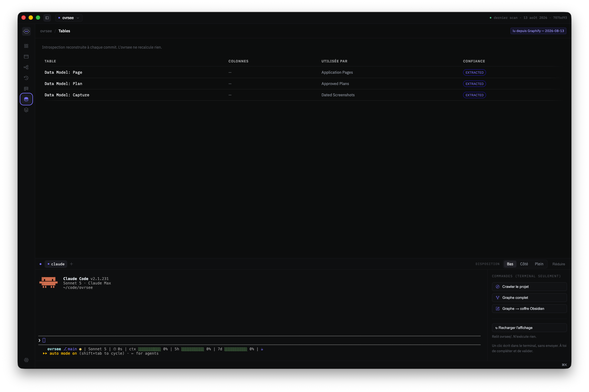
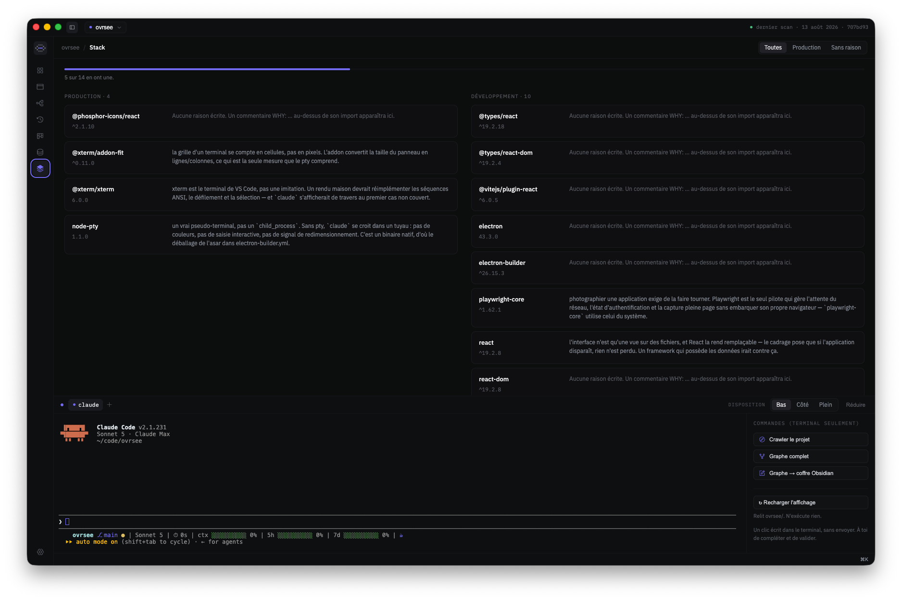

<p align="center">
  <a href="./README.md"></a>
  <a href="./README.fr.md"></a>
</p>

<div align="center">
  

  # Ovrsee

  **Vibecode fast, without losing track of the project.**

  
  
  
</div>

Project management for Claude Code. Ovrsee keeps track of what you build: the plans you
approved, the commits that carry them out, the tickets left to do, the app architecture
and how it changes. Enough to know where you stand when you code at the agent's pace,
and what to do next.

> **Ovrsee reads; it only runs a terminal if you ask.** The truth lives in `<repo>/ovrsee/`,
> in markdown and images, versioned by git. The app is just a view — if it disappears, nothing is lost.

Full context (French): [`cadrage-ovrsee.md`](./cadrage-ovrsee.md)

## Three principles

**A plan, its commits, its tickets.** Every plan approved in Claude Code becomes a line of
the project: what was decided, what carried it out, what is still open.

**The project lives in the repository.** Backlog, history and screenshots under
`<repo>/ovrsee/`, versioned by git. No tool to keep up to date alongside the code.

**Claude Code reads it, and writes to it.** An MCP server and two skills: the agent knows
your backlog, opens and moves tickets. It runs no code — you stay in charge of the plan.

## What it does

- Automatically captures approved plans from Claude Code — why a decision was made,
  not just what changed.
- Photographs every screen on every commit: a dated visual history of the app.
- Maps the observed project's pages and their dependencies.
- Keeps a ticket board and a work timeline, linked back to the plans that explain them.
- Everything is stored as versioned markdown and images — nothing depends on the app
  itself to stay readable.

## Screenshots

### Overview — project state at a glance


Counters (pages, plans, tickets, dependencies), repo health, open plans, branch status,
project commands, and the integrated terminal with its shortcuts (crawl, graph, Obsidian
export). On the right, the deployments panel and the `README.md` outline.

### Navigator — browse the observed app without leaving Ovrsee


An embedded browser (address bar, DevTools, element picker) to inspect the
observed application directly from the interface.

### Product — the navigation graph


A map of the crawled project's pages, with screenshot thumbnails, a detail panel
per page, and its capture history. Two dates can be compared.

### History — every commit and the plan behind it


The project timeline: a plan is closed by the commit that executes it, each linked
ticket shows up with its status. Filterable by plans, tickets, and off-plan commits.

### Board — ticket kanban


One file per ticket in `ovrsee/tickets/`, columns set in `ovrsee/board.json`.
Written here just like from the integrated terminal. Epics show their progress and
their child tickets.

### Data — the project's tables


Introspection rebuilt on every commit, read from Graphify or an Obsidian vault: tables,
columns, who uses them, and how confident the extraction is. Ovrsee recomputes nothing.

### Stack — dependencies and why they are there


Production and development split apart, each with its version and the reason written as a
`WHY:` comment above its import. Anything missing one is flagged.

## First launch

A freshly cloned — or downloaded — ovrsee opens **empty**: no project is watched
until you point at one. A three-screen modal then explains what the app does, tunes
the interface to how you use Claude Code, and leads to picking a first repository.
It is skippable in one click — or with Escape — and replayable from *Preferences →
General → Replay the walkthrough*.

The answers are not decorative: they pick which tabs show, where the terminal sits,
and which command is offered when a fresh project opens. Everything stays editable
in Preferences afterwards.

## Install

### Install the app — the normal way

Download the build for your platform from the
[Releases](https://github.com/samuelboulery/ovrsee/releases) tab. They are **neither
signed nor notarised**: macOS refuses the first launch — right-click the app, then
*Open* — and Windows shows a SmartScreen warning, which you get past with *More info*
then *Run anyway*.

| Platform | Format |
|---|---|
| macOS (arm64) | `.dmg`, unsigned |
| Windows (x64) | NSIS installer, unsigned |

**There is nothing else to install.** No clone, no `pnpm`, no command line. Everything
happens in the interface:

1. Point at a repository. The equipment screen writes `ovrsee/`, installs the git and
   Claude Code hooks, and offers the two skills.
2. Fill in two fields — the command that starts your app, and the URL it answers on.
   That writes `ovrsee.config.json`.
3. Click **Crawl** on the Product tab. The app maps your screens and photographs them.

Crawling drives the **Google Chrome already installed on your machine** — nothing is
downloaded on first run. Without Chrome, every other tab still works; only the map stays
empty.

### From source — to contribute

```bash
pnpm install
pnpm electron          # app with integrated terminal
pnpm dev               # or browser, no terminal
```

This is also where the CLI equivalents live, for scripting or for equipping a project
without opening the app:

```bash
pnpm ovrsee:install /path/to/project   # equip a repository
pnpm ovrsee:crawl /path/to/project     # map it (needs ovrsee.config.json)
pnpm ovrsee:brief                      # read the state as text
```

Packaging locally, without publishing:

```bash
pnpm package:mac    # DMG in release/ (arm64)
pnpm package:win    # NSIS installer in release/ (x64, from Windows only)
```

Releases themselves are built by `.github/workflows/release.yml` on every `vX.Y.Z` tag
push, on native runners, and published to the Releases tab.

## Plans, commits, tickets

When a plan is approved in Claude Code, it is captured automatically in `ovrsee/plans/`.
The post-commit hook then attaches each commit to the active plan. Close the plan when work is done:

```bash
pnpm ovrsee:close     # releases the active plan
```

While a plan is active, every commit gets attached to it — even unrelated fixes.
Closing is not optional: it lets you switch tasks without polluting the history.

**Squash-merging on GitHub runs no hook**, so the merge commit is born on their
servers and nothing attaches it. `git pull` catches up: a `post-merge` hook reads
the tickets cited in the message and attaches the commit to every open plan they
belong to. A repository equipped before that hook existed catches up once with:

```bash
pnpm ovrsee:reconcile
```

The **terminal is integrated in Electron only** — it runs over IPC, not a socket.
This is intentional: a socket would be open to any process on the same user. It's
a full terminal: the pty opens a login shell and starts `claude` in it. The crawl takes
the same route, for the same reason, and never `/api/*`.

## Claude Code Skills

Two skills, installed from the init screen or with `--skills`:

| Skill | What it teaches |
|---|---|
| `ovrsee` | Read `ovrsee/`: plans, pages, screenshots, pitfalls |
| `ovrsee-tickets` | Write board tickets, format, gestures |

**Graphify** (feeds the Data tab) is detected but not installed — the app shows the command.

## Obsidian Vault Export

```bash
pnpm ovrsee:obsidian          # or the button on the Overview tab
```

Translates `ovrsee/` into Obsidian notes under `ovrsee/obsidian/`: YAML frontmatter
(queryable with Dataview), wikilinks between plans/tickets/pages, and the screenshots.
It's a view — the source stays the repo, re-exporting overwrites.

Graphify writes its own `index.md` at the root of whatever folder you give it. Reserve
it `graphe/`, which the export never touches:

```bash
/graphify . --obsidian --obsidian-dir ovrsee/obsidian/graphe
```

That's what the "◈ Graph → Obsidian vault" button in the integrated terminal does.

### Vault as the Data tab's source

If you document in Obsidian instead of Graphify, the `obsidianVault` field in
`ovrsee.config.json` points at a vault, and the Data tab reads it **only when
Graphify produced nothing**.

A note is a table when its frontmatter carries `type: table`. `columns` gives the
columns, `maj` the last-updated date:

```markdown
---
type: table
titre: Orders
columns: [id, client_id, total]
maj: 2026-03-12
---

The orders placed.
```

**Graphify always takes precedence** — its graph comes from the code, the vault's
from whatever someone typed. A declared vault is not read while `graphify-out/graph.json`
exists.

## Multi-project setup and ovrsee.config.json

Full example:

```json
{
  "dev": "pnpm dev --port 8099 --strictPort",
  "baseUrl": "http://localhost:8099",
  "entryRoutes": ["/", "/login"],
  "auth": { "storageState": ".ovrsee-auth.json" },
  "ignore": ["/auth/callback"],
  "obsidianVault": "~/Vaults/my-project"
}
```

Give dev a dedicated port. The crawler refuses to start if `baseUrl` already responds —
there is no way to distinguish your own server from another's in an HTTP response, and
crawling the wrong app would produce backdated screenshots of the wrong project.

## Architecture Overview

| Directory | Role |
|---|---|
| `hooks/` | Plan capture, commit-time closing, catch-up on pull, tickets, Obsidian export, CLI |
| `crawl/` | Playwright traversal of the app, dated screenshots |
| `server/` | `/api/*` routes for browser and Electron |
| `mcp/` | MCP server (stdio, JSON-RPC 2.0), same interface as `/api/*` |
| `app/src/` | React interface, 7 tabs (overview, navigator, product, history, board, data, stack) |
| `electron/` | Main process, preload, pty (integrated terminal) |
| `scripts/` | Build and test utilities |

## Dependencies

Deliberately minimal: **5 production dependencies**, everything else is plain Node and React.

**Production**

| Package | Version | Why |
|---|---|---|
| `@phosphor-icons/react` | ^2.1.10 | the interface's icons |
| `@xterm/xterm` | 6.0.0 | the integrated terminal |
| `@xterm/addon-fit` | ^0.11.0 | it follows the panel's size |
| `node-pty` | 1.1.0 | a real pty behind that terminal |
| `playwright-core` | ^1.62.1 | drives the crawl, in the packaged app too |

**Development**

| Package | Version |
|---|---|
| `react` | ^19.2.8 |
| `react-dom` | ^19.2.8 |
| `typescript` | ^7.0.2 |
| `vite` | ^8.2.1 |
| `electron` | 43.3.0 |
| `electron-builder` | ^26.15.3 |
| `@vitejs/plugin-react` | ^6.0.5 |
| `@types/react` | ^19.2.18 |
| `@types/react-dom` | ^19.2.4 |

Package manager: `pnpm@10.34.5`, pinned in `package.json` and enforced by Corepack.

## Known Traps

**An active plan captures every commit of its session.**
The active plan belongs to a Claude session, not to the repository: it lives in `ovrsee/.active/<session>.json`, which git ignores. Several sessions can therefore work side by side on the same repository without stealing each other's plan. Within one session, though, every commit is attached — including unrelated fixes. Run `pnpm ovrsee:close` before switching tasks.

**A commit whose session is unknown may end up attached to nothing.**
Attribution goes through four stages: a `T-XXXX` ticket quoted in the commit message, then the session (`CLAUDE_CODE_SESSION_ID`, inherited by the git hook), then the single active plan if there is only one, then nothing. A commit made outside Claude Code, with no ticket quoted, while two plans are active, is attached nowhere — and says so on stderr.

**The crawler refuses to start if `baseUrl` already responds.**
This is intentional. There is no way to distinguish your own server from another's in an HTTP response, and crawling the wrong app would produce backdated screenshots.

**The crawl needs Google Chrome installed.**
`playwright-core` ships with the app but no browser does: the crawler drives the system
Chrome (`channel: 'chrome'`). Nothing is downloaded on first run, and nothing warns you
up front — a machine without Chrome simply records a failed scan.

**`node-pty` is a native binary.**
It is unpacked from the asar (`asarUnpack` in `electron-builder.yml`) and
`spawn-helper` must retain its execute bit — hence `scripts/fix-pty-permissions.js` in postinstall.
This is the classic packaging breaking point and only shows up when running the DMG, never in dev.

**A secret pasted into an approved plan goes into git history in plain text.**
The fix is upstream — don't paste it. Credentials live in a password manager and in an unversioned `ACCESS.md`.

## MCP Server

Ovrsee exposes an MCP (Model Context Protocol) server over stdio. It's how Claude
Code reads and edits tickets without leaving its interface.

Capabilities:
- Full read access to `ovrsee/`
- Write access to `ovrsee/tickets/` and `ovrsee/board.json` only
- No code execution

It only reads projects from the registry — the one `pnpm ovrsee:install` populates.
A path not listed there is refused, even if it exists on disk.

To register it in Claude Code:

```bash
claude mcp add -s user ovrsee -- node /absolute/path/ovrsee/mcp/server.js
```

The `user` scope is the right one: the server is multi-project by design, it has
nothing to do with the current repo.

From the **installed app**, with no clone, the server is inside the bundle. It is not
`node` that runs it but the Ovrsee binary in node mode — that is what reads `app.asar`:

```bash
claude mcp add -s user ovrsee -- \
  env ELECTRON_RUN_AS_NODE=1 \
  "/Applications/Ovrsee.app/Contents/MacOS/Ovrsee" \
  "/Applications/Ovrsee.app/Contents/Resources/app.asar/mcp/server.js"
```

In Claude Desktop, it's `claude_desktop_config.json`:

```json
{
  "mcpServers": {
    "ovrsee": {
      "command": "node",
      "args": ["/absolute/path/ovrsee/mcp/server.js"]
    }
  }
}
```

Skills aren't visible there: `~/.claude/skills/` is read by Claude Code — both the
CLI and the desktop app — but not by the Claude Desktop chat, which keeps its own catalog.

To see it answer by hand:

```bash
printf '%s\n' \
 '{"jsonrpc":"2.0","id":1,"method":"initialize","params":{"protocolVersion":"2024-11-05"}}' \
 '{"jsonrpc":"2.0","id":2,"method":"tools/list"}' \
 | pnpm ovrsee:mcp
```

(The server reads JSON-RPC from stdin and writes to stdout. Nothing else should
print to stdout: it's the transport, not a log.)

## Data Produced

Stored in the observed repo, under `<repo>/ovrsee/`:

```
plans/<date>-<slug>.md    1 file = 1 approved plan
pages/pages.json          pages, links, summaries
pages/scans.jsonl         1 line per scan — failures too
pages/shots/<tab>/        dated screenshots, tied to a commit
tickets/*.md              board tickets
board.json                board state
```

Backlog, history, and activity density are all computed from the plans.

## Important Note

**A secret pasted into an approved plan ends up in git history,** and removing it
requires a rewrite. Don't gitignore it away — an unversioned plan is worthless.
The fix is upstream — don't paste a key, token, or password into a plan. Credentials
live in a password manager and in an unversioned `ACCESS.md`.

## Running Tests

```bash
pnpm test       # Node tests (hooks, crawl, server, mcp) + UI tests (app/src)
pnpm typecheck  # TypeScript check (app/src only)
```

The project uses Node's built-in `test` module only — no test frameworks, anywhere.

## See also

- [`README.fr.md`](./README.fr.md) — French version
- [`CLAUDE.md`](./CLAUDE.md) — technical reference (French)
- [`cadrage-ovrsee.md`](./cadrage-ovrsee.md) — design rationale (French)
