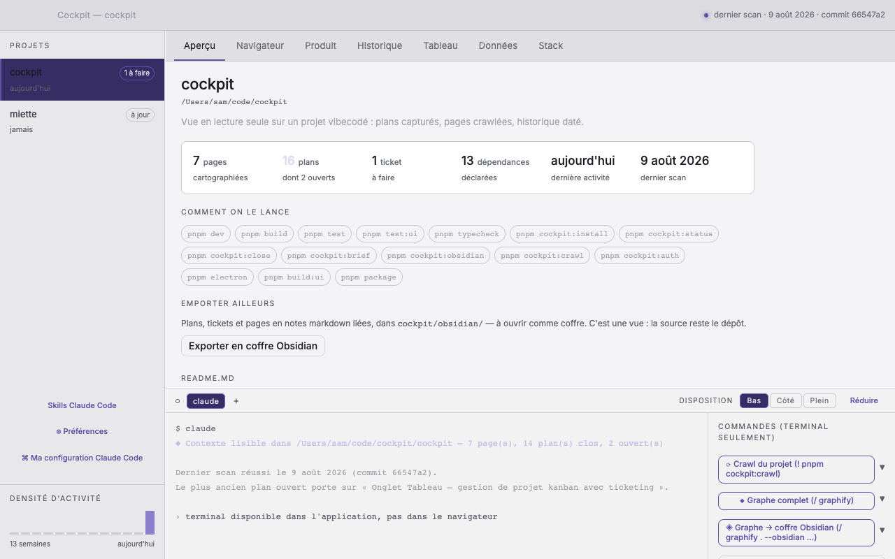

# Ovrsee

Une vue en lecture seule sur un projet développé en vibecoding : ce qui a été fait,
pourquoi, ce qui reste ouvert, et à quoi l'application ressemblait à chaque commit.

**L'ovrsee lit ; il n'exécute que le terminal qu'on lui demande.** La vérité vit dans `<repo>/ovrsee/`, en
markdown et en images, versionnée par git. L'application n'est qu'une vue : si elle
disparaît, rien n'est perdu.

Contexte complet : [`cadrage-ovrsee.md`](./cadrage-ovrsee.md) — [`README.en.md`](./README.en.md)

## Ce qu'on y voit

L'application capture les plans approuvés, photographie chaque écran à chaque commit,
énumère les pages et leurs dépendances, et tient l'historique daté — tout dans `ovrsee/`.



## Premier lancement

Un ovrsee fraîchement cloné, ou téléchargé, s'ouvre **vide** : aucun projet n'est
observé tant qu'on n'en a pas désigné un. Une modale de trois écrans explique alors ce
que fait l'application, règle l'interface d'après votre usage de Claude Code, et mène
au choix du premier dépôt. Elle se passe d'un clic — ou de la touche Échap — et se
rejoue depuis *Préférences → Général → Revoir la présentation*.

Les réponses ne sont pas décoratives : elles choisissent les onglets affichés, la
place du terminal et la commande proposée à l'ouverture d'un projet neuf. Tout
reste modifiable ensuite dans les préférences.

## Mise en route — trois commandes

```bash
# 1. Installer une fois par projet
pnpm ovrsee:install /chemin/du/projet

# 2. Cartographier l'application (nécessite un ovrsee.config.json)
pnpm ovrsee:crawl /chemin/du/projet

# 3. Lire
pnpm electron          # application avec terminal intégré
pnpm dev               # ou dans un navigateur, sans terminal
pnpm ovrsee:brief     # ou en texte, depuis le terminal
```

Quand un plan est approuvé dans Claude Code, il est capturé automatiquement dans `ovrsee/plans/`.
Le hook post-commit rattache ensuite chaque commit au plan actif. Clore le plan quand son travail est fini :

```bash
pnpm ovrsee:close     # retire .active-plan
```

Tant qu'un plan est actif, le hook post-commit lui rattache **tout** commit — même ceux
sans rapport. Clore n'est pas une formalité : c'est ce qui vous permet de changer de sujet
sans encombrer l'historique.

Le terminal intégré n'existe que dans l'application : il passe par IPC, qu'un
navigateur n'a pas. C'est délibéré — l'exposer par une socket locale l'ouvrirait à
tout processus tournant sous le même compte. C'est un terminal complet : le pty ouvre
un shell de connexion et y lance `claude`.

## Skills Claude Code

Deux skills disponibles — installer depuis l'écran d'initialisation, ou via `--skills` :

| Skill | Ce qu'il apprend |
|---|---|
| `ovrsee` | Lire `ovrsee/` : plans, pages, scans, captures, pièges de lecture |
| `ovrsee-tickets` | Écrire les tickets du tableau, format et gestes compris |

**Graphify** (alimente l'onglet Données) est détecté mais non installé — l'ovrsee
affiche sa commande.

## Coffre Obsidian

```bash
pnpm ovrsee:obsidian          # ou le bouton de l'onglet Accueil
```

Traduit `ovrsee/` en notes Obsidian dans `ovrsee/obsidian/` : frontmatter YAML
(requêtable en Dataview), wikilinks entre plans/tickets/pages, et les captures.
C'est une vue — la source reste le dépôt, réexporter écrase.

Graphify écrit son propre `index.md` à la racine du dossier qu'on lui donne. Réservez-lui `graphe/`,
que l'export ne touche jamais. Exemple :

```bash
/graphify . --obsidian --obsidian-dir ovrsee/obsidian/graphe
```

C'est ce que fait le bouton « ◈ Graphe → coffre Obsidian » du terminal intégré.

### Coffre comme source de l'onglet Données

Si vous documentez dans Obsidian plutôt qu'avec Graphify, le champ `obsidianVault`
dans `ovrsee.config.json` désigne un coffre, et l'onglet Données le lit **quand Graphify
n'a rien produit**.

Une note est une table quand son frontmatter porte `type: table`. `columns` en donne
les colonnes, `maj` la date de dernière mise à jour :

```markdown
---
type: table
titre: Commandes
columns: [id, client_id, total]
maj: 2026-03-12
---

Les commandes passées.
```

**Graphify passe devant, toujours** — son graphe vient du code, celui du coffre de ce
que quelqu'un a tapé. Un coffre déclaré alors que `graphify-out/graph.json` existe n'est
pas lu.

## Multi-projets et ovrsee.config.json

Exemple complet :

```json
{
  "dev": "pnpm dev --port 8099 --strictPort",
  "baseUrl": "http://localhost:8099",
  "entryRoutes": ["/", "/login"],
  "auth": { "storageState": ".ovrsee-auth.json" },
  "ignore": ["/auth/callback"],
  "obsidianVault": "~/Coffres/mon-projet"
}
```

Donnez au dev un port dédié. Le crawl refuse de démarrer si `baseUrl` répond déjà —
rien dans une réponse HTTP ne permet de reconnaître son propre serveur, et photographier
celui d'un autre projet produirait des captures datées d'aujourd'hui montrant la mauvaise application.

## Arborescence

| Dossier | Rôle |
|---|---|
| `hooks/` | Capture des plans, clôture au commit, tickets, export Obsidian, CLI |
| `crawl/` | Parcours Playwright de l'app, captures datées |
| `server/` | Routes `/api/*` pour navigateur et Electron |
| `mcp/` | Serveur MCP stdio (JSON-RPC 2.0), même interface que `/api/*` |
| `app/src/` | Interface React, 7 onglets (aperçu, navigateur, produit, historique, tableau, données, stack) |
| `electron/` | Processus principal, preload, pty (terminal intégré) |
| `scripts/` | Utilitaires de build et test |

## Pièges connus

**Un plan actif capte tous les commits.**
Tant que `ovrsee/.active-plan` existe, le hook post-commit rattache chaque commit au
plan — y compris un correctif sans rapport. `pnpm ovrsee:close` avant de changer de sujet.

**Le crawl refuse de démarrer si `baseUrl` répond déjà.**
C'est voulu. Rien dans une réponse HTTP ne distingue son propre serveur de celui d'un
autre projet.

**`node-pty` est un binaire natif.**
Il est déballé de l'asar (`asarUnpack` dans `electron-builder.yml`) et
`spawn-helper` doit garder son bit d'exécution — d'où `scripts/fix-pty-permissions.js`
en postinstall. C'est le point de rupture classique de l'empaquetage, et il ne se voit
qu'à l'exécution du DMG, jamais en dev.

**Un secret collé dans un plan approuvé part dans git en clair.**
La parade est en amont : ne pas en coller. Les identifiants vivent dans un gestionnaire
de mots de passe et dans un `ACCESS.md` non versionné.

## Serveur MCP

Ovrsee expose un serveur MCP (Model Context Protocol) en stdio. C'est le moyen pour
Claude Code de lire et modifier les tickets sans quitter son interface.

Capacités :
- Lecture complète de `ovrsee/`
- Écriture sur `ovrsee/tickets/` et `ovrsee/board.json` uniquement
- Aucune exécution de code

Il ne lit que les projets du registre — celui qu'alimente `pnpm ovrsee:install`.
Un chemin qui n'y figure pas est refusé, même s'il existe sur le disque.

Pour l'enregistrer dans Claude Code :

```bash
claude mcp add -s user ovrsee -- node /chemin/absolu/ovrsee/mcp/server.js
```

La portée `user` est la bonne : le serveur est multi-projet par construction,
il n'a rien à voir avec le dépôt courant.

Dans Claude Desktop, c'est `claude_desktop_config.json` :

```json
{
  "mcpServers": {
    "ovrsee": {
      "command": "node",
      "args": ["/chemin/absolu/ovrsee/mcp/server.js"]
    }
  }
}
```

Les skills, elles, n'y sont pas visibles : `~/.claude/skills/` est lu par Claude
Code — en ligne de commande comme dans l'application de bureau — mais pas par le
chat de Claude Desktop, qui tient son propre catalogue.

Pour le voir répondre à la main :

```bash
printf '%s\n' \
 '{"jsonrpc":"2.0","id":1,"method":"initialize","params":{"protocolVersion":"2024-11-05"}}' \
 '{"jsonrpc":"2.0","id":2,"method":"tools/list"}' \
 | pnpm ovrsee:mcp
```

(Le serveur lit JSON-RPC depuis stdin et écrit sur stdout. Rien d'autre ne doit
sortir sur stdout : ce n'est pas un journal, c'est le transport.)

## Données produites

Stockées dans le dépôt observé, sous `<repo>/ovrsee/` :

```
plans/<date>-<slug>.md    1 fichier = 1 plan approuvé
pages/pages.json          pages, liens, résumés
pages/scans.jsonl         1 ligne par scan — les échecs aussi
pages/shots/<onglet>/     captures datées, rattachées à un commit
tickets/*.md              tickets du tableau
board.json                état du tableau
```

Backlog, historique et densité d'activité se calculent à partir des plans.

## Note importante

**Un secret collé dans un plan approuvé se retrouve dans l'historique git,** et l'y
retirer demande une réécriture. Ne pas l'ignorer via `.gitignore` — un plan non
versionné ne sert à rien. La parade est en amont — ne pas coller de clé, de jeton
ni de mot de passe dans un plan. Les identifiants vivent dans un gestionnaire et dans
un `ACCESS.md` non versionné.
